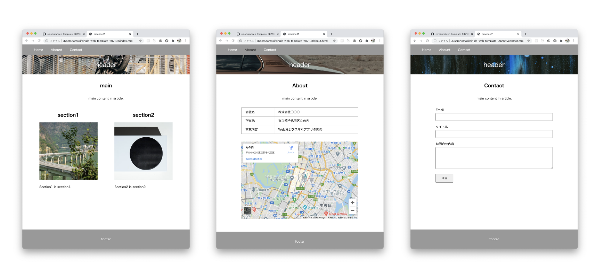

## 説明

2021年3月時点でのHTML記述方法の参考テンプレート。
Web制作に必要な要素を散りばめてあるつもり。これをベースに各種レイアウトを作ればよいかなと。

## 主な要素

* レスポンシブ
* flex-boxレイアウト
* IE11対応

## 完成イメージ

画像はunsplashからAPIで取得してるため随時変わります。

## 注意点

contact.html中のbase_urlを自身のGoogle Apps Script（API）のURLに変更する必要があります。
セットアップ方法は[こちら](https://qiita.com/zaburo/private/a92ec920c83090f454a1)をご覧ください。